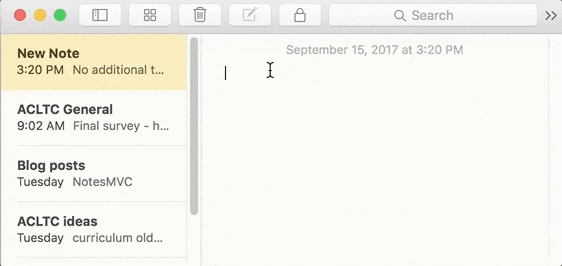

# React Redux Notes

## Description
A notes app to practice React with redux like described in [this article](https://medium.com/actualize-network/comparing-frontend-frameworks-part-1-introduction-6cf3d49e42cf)

This is what the desktop Mac Notes app looks like:

## Run the app:

1) `git clone git@github.com:faniepotgieter/react-redux-notes.git`
2) `cd react-redux-notes`
3) `npm install`
4) `npm start`